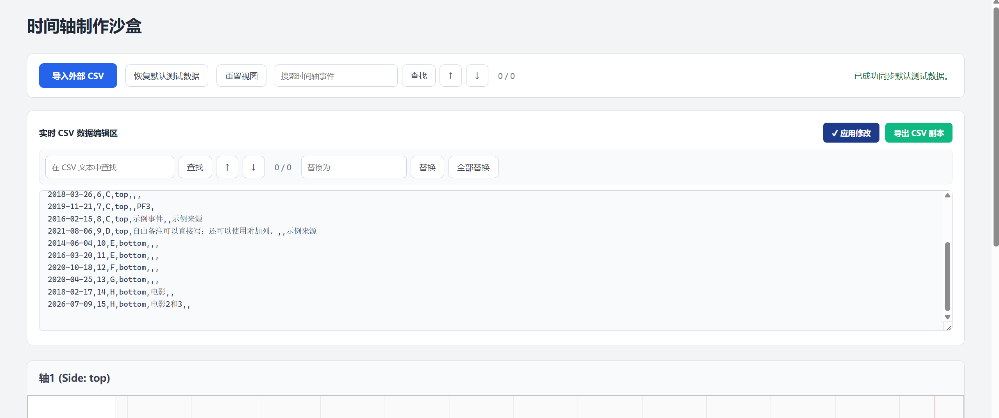
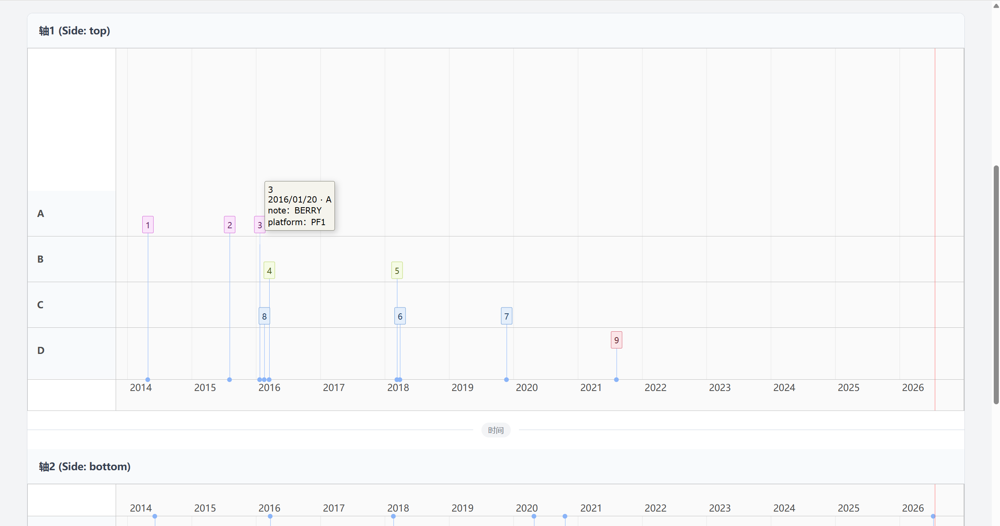
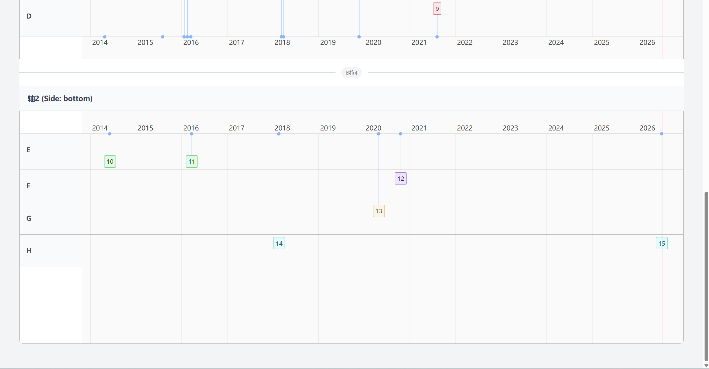

# 网页版时间轴制作工具

## 简介

这是一个基于 Vite 和 vis-timeline 的网页版时间轴制作工具，借助AI开发。

项目包含以下主要功能：

- 通过导入csv文件将事件呈现在时间轴上
- 导入和导出 CSV 文件
- csv数据内容的增删改查及时间轴上事件信息的实时更新
- 数据文本查找替换和事件查找功能
- 缩放和拖拽时间轴
- 事件类别的泳道显示和颜色区分
- 事件上鼠标悬浮查看更多信息

对于这个工具可以：
- 在线使用 kakabon.github.io/timelineMakerSite/
- 下载或克隆到本地后直接点击根目录的 run.bat 拉起服务并在浏览器中打开 http:// localhost:5173 使用，前提是已有node环境+在根目录运行`npm install` 安装依赖
- 下载或克隆到本地按需开发

csv数据格式要求必须有：
- date （日期）
- title  (事件名目)
- category 或 group （分类）（二选一）
- side  （轴区）

其它字段按需添加，如note（备注）、platform（平台）、source（来源）、author（作者）等

```csv
date,title,category,side,note,platform,source,author
2014-04-25,1,A,top,NOTE1,aaaaaa,c,b
2015-08-02,2,A,top,对事件2的备注,,
2016-01-20,3,A,top,BERRY,PF1,
2016-03-14,4,B,top,,,
2018-03-09,5,B,top,,PF2,
2018-03-26,6,C,top,,,
2019-11-21,7,C,top,,PF3,
2016-02-15,8,C,top,示例事件,,示例来源
2021-08-06,9,D,top,自由备注可以直接写；还可以使用附加列。,,示例来源
2014-06-04,10,E,bottom,,,
```
顺序随意，譬如以下这样也可以
```csv
date,title,side,note,platform,source,author,category
2014-04-25,1,top,NOTE1,aaaaaa,c,b,B
```
```csv
title,side,date,group
1,top,2014-04-25,B
```








## Acknowledgements

This project is built upon several open-source projects.

- vis-timeline
  https://github.com/visjs/vis-timeline

- Vite
  https://vite.dev/

Please refer to the original repositories for license information.